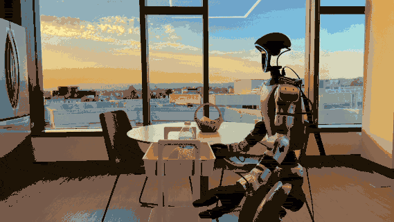

# About

I am a senior undergraduate student majoring in **Robotics Engineering** at Soochow University.

<!-- 
I am a Remote Research Intern at the <a href="https://psi-lab.ai/" style="color: #0d47a1;">Physical Superintelligence (PSI) Lab</a> at the University of Southern California,collaborating with <a href="https://songlin.github.io/" style="color: #0d47a1;">Songlin Wei</a> and supervised by Prof. <a href="https://yuewang.xyz/" style="color: #0d47a1;">Yue Wang</a>, since July 2025. My research interests lie in Simulation and Embodied AI, with a particular focus on addressing data scarcity in robotic learning. 

{:.message style="background-color: #e3f2fd; padding: 15px; border-radius: 5px; border: 1px solid #90caf9; color: #0d47a1;"}
**🔥 I am actively looking for Fall 2027 PhD opportunities! I am also open to discussing potential research collaborations. Please feel free to contact me!** -->

## News

- **[Mar 2026]** Our paper <a href="https://psi-lab.ai/Psi0" style="color: #0d47a1; font-weight: bold;">Ψ₀</a> was released on arXiv!
<!-- - **[July 2025]** Joined USC PSI Lab as a Research Intern. -->
<!-- - **[Date]** [Template] Paper accepted to [Conference]. -->

## Publications

* 

    
    
    

      <strong style="font-size: 1.1em; display: block; margin-bottom: 5px;">Ψ₀: An Open Foundation Model Towards Universal Humanoid Loco-Manipulation</strong>
      Songlin Wei*, Hongyi Jing*, Boqian Li*, Zhenyu Zhao*, Jiageng Mao, <b>Zhenhao Ni</b>, Sicheng He, Jie Liu, Xiawei Liu, Kaidi Kang, Sheng Zang, Marco Pavone, Di Huang, Yue Wang†
       
      <em style="color: #020202ff;">Arxiv Preprint</em>, 2026.
       

      Ψ₀ is an open vision-language-action (VLA) model for dexterous humanoid loco-manipulation.
      

        <a href="https://arxiv.org/abs/2603.12263" target="_blank" style="margin-right: 20px; font-weight: bold;">[arXiv]</a>
        <a href="https://psi-lab.ai/Psi0" target="_blank" style="font-weight: bold;">[Project Page]</a>
      

    

  

{: .publication-list }
## Education 

* **Soochow University**
     
    *B.Eng. (Senior)*, Robotics Engineering
     
    *2022 - Expected 2026* 

## Contact

Feel free to reach out if you're interested in collaboration or have questions about my work:

- **Email**: [zhenhaoni4@gmail.com](mailto:zhenhaoni4@gmail.com)
- **GitHub**: [@Nizhenhao-3](https://github.com/Nizhenhao-3)
- **Twitter**: [@ZhenHaoNi1](https://x.com/ZhenHaoNi1)

---

<!-- *When I consider the short duration of my life, swallowed up in the eternity before and after… I am frightened, and astonished to see myself here rather than there.* -->
{:.lead}  

<!-- I am also a Remote Research Intern at the <a href="https://psi-lab.ai/" style="color: #0d47a1;">Physical Superintelligence (PSI) Lab</a> at the University of Southern California, collaborating with <a href="https://songlin.github.io/" style="color: #0d47a1;">Songlin Wei</a> and supervised by Prof. <a href="https://yuewang.xyz/" style="color: #0d47a1;">Yue Wang</a>, since July 2025. My research interests lie in Simulation and Embodied AI, with a particular focus on addressing data scarcity in robotic learning. 

{:.message style="background-color: #e3f2fd; padding: 15px; border-radius: 5px; border: 1px solid #90caf9; color: #0d47a1;"}
**🔥 I am actively looking for Fall 2027 PhD opportunities! I am also open to discussing potential research collaborations. Please feel free to contact me!** -->

